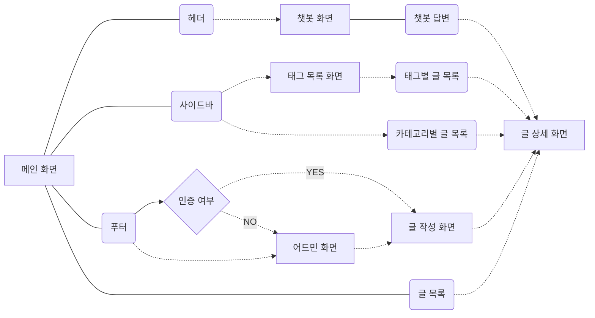
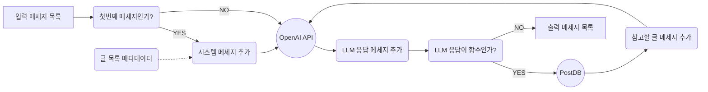

## 나만의 블로그 + 챗봇

```mermaid
flowchart LR
    Home[메인 화면]
    Header(헤더)
    Footer(푸터)
    Sidebar(사이드바)
    List(글 목록)

    Home --- Header
    Home --- Footer
    Home --- Sidebar
    Home --- List

    Create[글 작성 화면]
    Admin[어드민 화면]
    Chatbot[챗봇 화면]
    ChatbotResult(챗봇 답변)
    Detail[글 상세 화면]
    Authorize{인증 여부}

    TagList[태그 목록 화면]
    Tag(태그별 글 목록)
    Category(카테고리별 글 목록)

    Header -.-> Chatbot --- ChatbotResult -.-> Detail
    Sidebar -.-> TagList -.-> Tag -.-> Detail
    Sidebar -.-> Category -.-> Detail
    Footer --> Authorize -.->|YES|Create -.-> Detail
    Authorize -.->|NO|Admin
    Footer -.-> Admin -.-> Create

    List -.-> Detail
```

## 나만의 챗봇 답변 플로우

```mermaid
graph LR
    Input[입력 메세지 목록]
    Output[출력 메세지 목록]
    LLM((OpenAI API))
    PostDB((PostDB))
    IsFirstMessage(첫번째 메세지인가?)
    System(시스템 메세지 추가)
    Response(LLM 응답 메세지 추가)
    IsFunction(LLM 응답이 함수인가?)
    PostResult(참고할 글 메세지 추가)
    PostListMetadata(글 목록 메타데이터)

    Input --> IsFirstMessage
    IsFirstMessage --> |YES|System --> LLM
    IsFirstMessage --> |NO|LLM

    PostListMetadata -.-> System
    LLM --> Response
    Response --> IsFunction

    IsFunction --> |YES|PostDB --> PostResult --> LLM
    IsFunction --> |NO|Output
```
